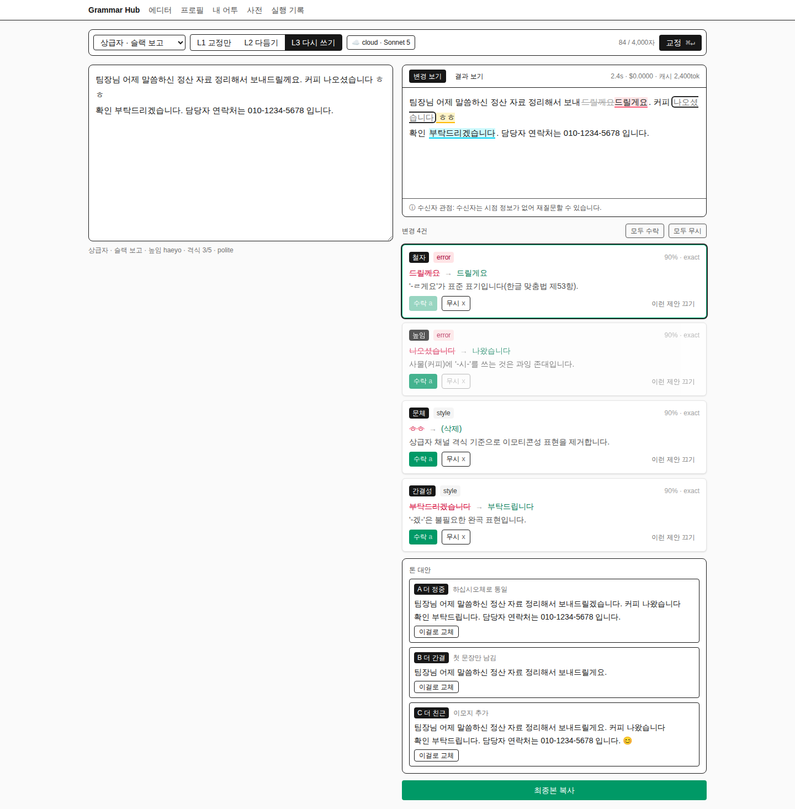
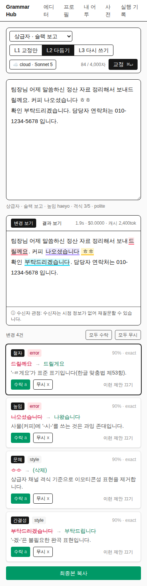
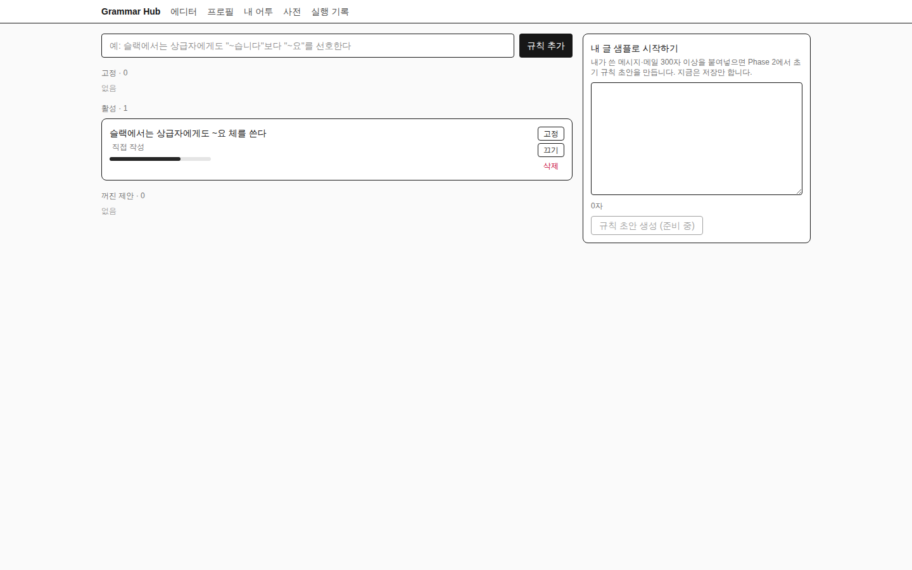

# UI · UX 검토와 디자인 방향 (v0.1, 2026-09-16)

> 대상: Phase 1 현재 화면(가짜 provider로 캡처, `docs/assets/ux-review/`). 결론과 실행 계획을 먼저, 근거는 뒤에.

---

## 0. 결론

**투박한 이유는 절반이 기술 실수, 절반이 정보 구조입니다.**

| 원인 | 내용 | 고치는 비용 |
|---|---|---|
| 테두리가 전부 검정 | Tailwind v4는 기본 테두리색이 글자색(검정)입니다. 색 없이 `border`만 쓴 곳이 59군데라 모든 박스가 1px 검정 선으로 그려집니다. | 10분 |
| 웹폰트 없음 | 시스템 기본 산세리프. 한글 UI 폰트(Pretendard)만 넣어도 인상이 달라집니다. | 30분 |
| 색 체계 없음 | 검정 버튼, 초록 복사 버튼, 빨강 텍스트, 파스텔 하이라이트 8색이 규칙 없이 섞여 있습니다. | 반나절 |
| 정보 구조 | 결과 · 카드 · 톤 대안 · 복사 버튼이 오른쪽에 세로로 쌓여 화면이 1,500px까지 길어지고, 핵심 버튼이 맨 아래에 있습니다. 왼쪽 절반은 빈 공간입니다. | 1~2일 |
| 개발자 정보 노출 | `L1/L2/L3`, `90% · exact`, `$0.0000 · 캐시 2,400tok`, `☁ cloud · Sonnet 5`가 사용자 화면에 그대로 보입니다. | 반나절 |

**권장 템플릿: shadcn/ui(Base UI 기본) + Pretendard + tweakcn 프리셋.** 이미 Tailwind v4를 쓰고 있어 마찰이 없고, 무료(MIT)이며, 필요한 컴포넌트(Card·Badge·Select·Slider·Table·Sidebar·Tabs·Popover·Toast)가 전부 있습니다. 유료 Catalyst($299)는 예쁘지만 지금 단계에 불필요합니다.

**실행 계획**: A안(빠른 수정, 반나절)만으로도 "투박함"의 60%는 사라집니다. B안(shadcn 전환 + 레이아웃 재구성, 2~3일)까지 하면 제품 수준이 됩니다. A는 B의 선행 작업이라 낭비가 없습니다.

---

## 1. 현재 화면 진단

### 1.1 에디터 (핵심 화면)



| # | 문제 | 왜 문제인가 | 우선순위 |
|---|---|---|---|
| 1 | **주요 행동 버튼이 화면 끝에** | "최종본 복사"가 카드·톤 대안 아래 1,400px 지점. 매번 스크롤해야 하고, 짧은 메시지에도 그렇습니다. | 높음 |
| 2 | **왼쪽 절반이 죽어 있음** | 원문 영역이 320px 고정 높이 뒤로는 빈 공간. 오른쪽은 세로로 끝없이 길어짐. 2단 레이아웃의 균형이 깨졌습니다. | 높음 |
| 3 | **강도 라벨이 내부 코드** | "L1 교정만 / L2 다듬기 / L3 다시 쓰기". 사용자에게 L1·L2·L3는 의미 없습니다. | 높음 |
| 4 | **개발 지표가 본문에** | `2.4s · $0.0000 · 캐시 2,400tok`, 카드마다 `90% · exact`. 만든 사람에게만 의미 있는 값입니다. | 높음 |
| 5 | **하이라이트가 시끄러움** | 카테고리별 파스텔 배경 8색 + 삭제선 + 밑줄이 한 줄에 겹칩니다. "커피 나오셨습니다 ㅎㅎ"처럼 인접 변경이 붙으면 읽기 어렵습니다. | 높음 |
| 6 | **카드 시각 위계 없음** | 오류(철자)와 스타일 제안(간결성)이 같은 무게. 검정 카테고리 칩 + 빨강 severity 칩이 매 카드마다 반복돼 눈이 쉴 곳이 없습니다. | 중간 |
| 7 | **버튼 안의 단축키 표기** | 모든 카드에 `수락 a` `무시 x`. 한 번 배우면 소음입니다. | 중간 |
| 8 | **provider 배지** | `☁ cloud · Sonnet 5`는 설정 항목이지 매번 볼 것이 아닙니다. 로컬일 때 "내 Mac에서 처리 중" 같은 신뢰 신호로 바꿔야 합니다. | 중간 |
| 9 | **빈 상태 안내 없음** | 처음 열면 회색 안내 한 줄뿐. 예시 문장 넣기 버튼, 단축키 안내가 없습니다. | 중간 |
| 10 | **톤 대안이 카드 아래 또 카드** | 세 안이 전문을 반복해 화면을 크게 차지. 탭이나 세그먼트로 하나씩 보여주고 차이만 강조해야 합니다. | 중간 |
| 11 | **결과 보기가 이중 테두리 textarea** | 박스 안에 또 박스. 편집 가능함을 알리는 다른 방법(연필 아이콘, 포커스 시 테두리)이 낫습니다. | 낮음 |
| 12 | **네이티브 select** | 브라우저 기본 셀렉트가 다른 요소와 어울리지 않습니다. | 낮음 |

### 1.2 모바일



- 상단 메뉴가 "에디 터 / 프로 필 / 내 어 투"로 **단어 중간에서 줄바꿈**됩니다. 한글은 `word-break: keep-all`이 기본이어야 합니다.
- 툴바가 3줄로 접히고, 원문 영역이 화면 절반을 차지한 뒤 결과가 그 아래로 밀립니다. 폰에서는 원문을 접고 결과를 먼저 보여줘야 합니다.
- 동작은 하지만 "슬랙 보내기 직전 폰에서 확인" 시나리오에는 부족합니다.

### 1.3 내 어투 · 실행 기록



- 규칙 카드에 신뢰도 막대가 있지만 라벨이 없어 무엇인지 알 수 없습니다. 고정/끄기/삭제 버튼이 크기·정렬이 제각각입니다.
- 화면 대부분이 빈 공간. 규칙이 없을 때 "이렇게 시작하세요" 안내가 필요합니다.
- 실행 기록은 관리자용 표 그대로입니다. 개인용이면 괜찮지만 "이번 주 수락률 78%, 비용 ₩1,200"처럼 요약 카드가 위에 있어야 표를 볼 이유가 생깁니다.

### 1.4 잘 된 것 (유지)

- 변경 보기 / 결과 보기 토글, 카드 hover와 본문 하이라이트 동기화, j/k/a/x 키보드, 복사 시점에 최종본을 기록하는 흐름은 그대로 가져갑니다.
- 카드 구성 요소(카테고리 · 원문→교정 · 이유 · 근거 링크 · 수락/무시/끄기)는 Grammarly와 같은 구조라 맞습니다. 표현만 정리하면 됩니다.

---

## 2. 목표 디자인 방향

### 2.1 레퍼런스에서 빌릴 것

| 제품 | 빌릴 것 |
|---|---|
| **DeepL Write** | 좌 입력 / 우 결과 2패널. 결과에서 변경부만 **은은한 초록 배경**, "변경 보기" 토글. 복사 버튼은 결과 패널 안에. |
| **Grammarly** | 우측 사이드 카드. 카테고리별 밑줄 색 4종(빨강=정확성, 파랑=명확성, 초록=표현, 보라=전달). 카드 클릭 시 본문 해당 위치로 스크롤. |
| **Apple Writing Tools** | 변경마다 이유 설명 + 원문 되돌리기, 패널 상단에 "모두 수락 / 되돌리기", 톤은 버튼 3개로 단순하게. |
| **Linear** | 밀도 높은 설정 화면, 좌측 고정 사이드바, 키보드 우선, 회색 단계 정교함. |

### 2.2 새 레이아웃 (데스크톱 ≥1024px)

```
┌ 사이드바 56px ─┬────────────────────────────────────────────────────────────┐
│ ✎ 에디터        │ [상급자 · 슬랙 보고 ▾]  [맞춤법만 | 다듬기 | 다시 쓰기]   [교정 ⌘↵] │
│ ◎ 프로필        ├──────────────────────────────┬─────────────────────────────┤
│ ✦ 내 어투       │ 원문                          │ 결과            [복사 ⌘⇧C]  │
│ ⌂ 사전          │                              │ ┌ 변경 보기 · 결과 보기 ┐     │
│ ▤ 기록          │ 팀장님 어제 말씀하신 정산     │ 팀장님, 어제 말씀하신 정산   │
│                │ 자료 정리해서 보내드릴께요.   │ 자료 정리해서 보내드릴게요.  │
│                │ ...                          │ ...                         │
│                │                              │ ⓘ 수신자 관점: 시점이 없어… │
│                │                              ├─────────────────────────────┤
│                │                              │ 변경 4  [모두 수락] [모두 무시]│
│                │                              │ ● 철자  드릴께요 → 드릴게요  │
│                │                              │   '-ㄹ게요'가 표준…   ✓  ✕  │
│                │                              │ ● 높임  나오셨습니다 → …     │
│                │                              │ ○ 문체  ㅎㅎ 제거            │
│                │                              │ ○ 간결  부탁드리겠 → 부탁드립 │
│                │                              ├─────────────────────────────┤
│ ⚙ (하단)        │                              │ 톤 대안  [정중] [간결] [친근] │
│ ☁/💻 상태 점    │                              │ (선택한 안 하나만 표시)       │
└────────────────┴──────────────────────────────┴─────────────────────────────┘
```

핵심 변경:
1. **복사 버튼을 결과 패널 헤더 우상단으로.** 교정이 끝나면 강조색으로 바뀝니다.
2. **오른쪽 패널을 위(결과 텍스트)·아래(카드 리스트, 자체 스크롤)로 분할.** 페이지 전체가 길어지지 않습니다.
3. **왼쪽 원문 영역이 패널 높이를 채웁니다.** 교정 후에는 접을 수 있게(폰에서는 기본 접힘).
4. **카드를 한 줄 요약 + 펼침**으로. 접힌 상태: 색점 · 카테고리 · `원문 → 교정` · ✓ ✕. 펼치면 이유·근거·끄기. 오류(●)와 스타일(○)을 점 모양으로 구분.
5. **톤 대안은 세그먼트 버튼 3개 + 본문 하나.** 선택하면 결과 패널에 그 안이 들어가고 diff로 차이를 보여줍니다.
6. **개발 지표는 하단 상태줄로.** `2.4초 · ₩31 · 캐시 적중` 정도를 작은 회색 글자로, 클릭하면 기록 페이지.
7. **provider는 사이드바 하단 상태 점.** 초록 점 "내 Mac", 파란 점 "클라우드". 전환은 설정에서.
8. **강도 라벨**: 맞춤법만 / 다듬기 / 다시 쓰기. 툴팁에 설명.

### 2.3 하이라이트 규칙 (본문)

| 상태 | 표현 |
|---|---|
| 대기 | 카테고리 색 **2px 점선 밑줄**만. 배경 없음. |
| 수락 | 교정된 텍스트가 자리 잡고 **연한 초록 배경**. hover 시 원문 툴팁. |
| 무시 | 표시 없음(원문 그대로). |
| 선택(카드 hover/포커스) | 해당 구간에 연한 배경 + 카드 테두리 강조. |

카테고리 색은 4계열로 묶습니다. 정확성(철자·띄어쓰기·문법·문장부호)=빨강, 높임·문체=보라, 명확성·간결성·어휘=파랑, 어조=주황. 10색은 사용자가 구분 못 합니다.

### 2.4 디자인 토큰 초안

```
폰트      Pretendard Variable (next/font/local, weight "45 920"), 숫자 tabular-nums
크기      UI 14px/1.6 · 에디터 본문 16px/1.75 · 카드 13.5px/1.55 · 자간 -0.01em · word-break keep-all
색(라이트) 배경 #FAFAFA · 패널 #FFFFFF · 테두리 #E5E5E5 · 본문 #171717 · 보조 #737373
강조      primary = neutral-900 (교정 실행) · success = emerald-600 (복사, 수락) · 카테고리 4색은 밑줄·점에만
반경      6px(입력·버튼) · 10px(패널)
그림자    패널에만 0 1px 2px rgba(0,0,0,.04). 카드는 테두리만.
간격      4px 배수. 패널 안쪽 16px, 카드 안쪽 12px, 카드 간격 8px
다크모드  shadcn 토큰으로 자동. 하이라이트 배경은 다크에서 투명도 낮춤
```

---

## 3. 템플릿 · 라이브러리 추천

### 3.1 추천 순위

| 순위 | 선택 | 이유 |
|---|---|---|
| **1** | **shadcn/ui** (2026-07부터 Base UI 기본, `npx shadcn@latest init`) | Tailwind v4 네이티브라 지금 스택과 마찰 0. MIT. 코드가 내 저장소에 들어오므로 제품화 때 라이선스·커스터마이즈 문제 없음. Card·Badge·Select·Slider·Tabs·Table·Sidebar·Popover·Tooltip·Toast(sonner)·Field·Item 전부 있음. `shadcn/create`로 base color·폰트·radius 프리셋을 고르고, **tweakcn.com**(무료, MIT)에서 색을 미세 조정해 CSS를 붙여넣습니다. |
| **2** | 레이아웃 뼈대: 공식 블록 `sidebar-07` + `arhamkhnz/next-shadcn-admin-dashboard`의 설정 페이지 패턴 | Next 16 · Tailwind v4 · 외부 SaaS 의존 없음 · MIT. 사이드바 셸과 설정 폼 레이아웃만 가져오고 나머지는 버립니다. `Kiranism/next-shadcn-dashboard-starter`는 Clerk 의존이 있어 표·폼 패턴 참고용으로만. |
| **3** | 타이포: **Pretendard Variable** 셀프호스팅 | OFL. `next/font/local`에 `weight: "45 920"`(WebKit 굵기 버그 회피). 숫자 많은 기록 표는 `tabular-nums` 또는 Pretendard GOV. |

### 3.2 검토했지만 비권장

| 후보 | 이유 |
|---|---|
| Catalyst (Tailwind Plus, $299 일회성) | 앱 셸 미학은 최상이지만 컴포넌트 수가 적어 Table·Slider 등은 결국 직접. shadcn 블록 + tweakcn으로 80%는 무료로 도달. 제품화가 확정되고 "한 단계 더"가 필요할 때 재검토. |
| Ant Design v6 | 표·폼은 최강이고 국내 엔터프라이즈에 익숙하지만, Tailwind와 별개의 스타일 체계와 큰 번들을 솔로 프로젝트에 들이는 비용이 큼. 미학도 "사내 관리 도구" 쪽. |
| HeroUI v3 | 화려하고 애니메이션이 많아 밀도 높은 편집기에는 과함. |
| Radix Themes | 예쁘지만 2025-01 이후 릴리스 정체. |
| Park UI | Panda CSS 전용으로 바뀌어 Tailwind 프로젝트에 부적합. |
| daisyUI 5 | 테마는 많지만 접근성 프리미티브(포커스 관리·키보드)가 없어 직접 구현해야 함. |
| Mantine · Chakra | 좋은 라이브러리지만 Tailwind와 이중 체계. |

### 3.3 shadcn 도입 시 매핑

| 현재 | shadcn |
|---|---|
| 네이티브 `<select>` 프로필 | `Select` 또는 `Combobox`(검색 가능) |
| 강도 세그먼트(버튼 3개) | `ToggleGroup` |
| 변경 카드 | `Card` 축소형 + `Badge` + `Collapsible` |
| 변경 보기/결과 보기 | `Tabs` |
| 톤 대안 A/B/C | `ToggleGroup` + 본문 1개 |
| 토스트 | `sonner` |
| 단축키 안내 | `Tooltip` + `Kbd`(`?` 키로 `Dialog`) |
| 프로필 편집 폼 | `Field` + `Select` + `Slider` + `Switch` |
| 규칙 리스트 | `Item` + `Progress`(신뢰도, 라벨 포함) + `DropdownMenu`(고정/끄기/삭제) |
| 기록 표 | `Table` + 상단 `Card` 4개(주간 요약) |
| 상단 nav | `Sidebar`(접히는 아이콘 레일) |

---

## 4. 실행 계획

### A안: 빠른 수정 (반나절) — 템플릿 없이 지금 코드에서

| 작업 | 파일 | 효과 |
|---|---|---|
| 기본 테두리색을 `neutral-200`으로 | `app/globals.css`에 `@layer base { *, ::before, ::after { border-color: var(--color-neutral-200) } }` | 검정 선 59곳이 한 번에 연회색으로 |
| Pretendard 적용 + `word-break: keep-all` + `tabular-nums` | `app/layout.tsx`(next/font/local), `globals.css` | 한글 인상, 모바일 줄바꿈 해결 |
| 강도 라벨 변경, 단축키 힌트 제거, 개발 지표를 작은 회색 상태줄로 | `Editor.tsx`, `SuggestionCard.tsx` | 사용자 언어로 |
| 복사 버튼을 결과 패널 헤더로, 완료 시 강조 | `Editor.tsx` | 핵심 행동 접근성 |
| 하이라이트를 점선 밑줄 + 4계열 색으로 축소 | `HighlightView.tsx` | 본문 가독성 |
| 카드 접힘/펼침, severity별 점 아이콘 | `SuggestionCard.tsx` | 위계 |
| 모바일: 교정 후 원문 접기 | `Editor.tsx` | 폰 사용 가능 |

### B안: shadcn 전환 + 레이아웃 재구성 (2~3일) — A안 위에

1. `npx shadcn@latest init` (Base UI, base color Neutral, radius 0.5) → `shadcn/create`에서 Pretendard 지정 → tweakcn에서 강조색 미세 조정.
2. `sidebar-07` 블록으로 앱 셸 교체(아이콘 레일 + 하단 provider 상태).
3. 에디터를 2.2 레이아웃으로 재구성: 결과 패널 상/하 분할, 카드 리스트 자체 스크롤.
4. 프로필·어투·사전·기록 페이지를 `Field`/`Item`/`Table`로 재작성, 빈 상태 컴포넌트 추가.
5. 다크모드는 토큰으로 자동 획득. E2E 셀렉터(`data-testid`) 유지.

### 하지 않을 것
- 랜딩 페이지·마케팅 템플릿(Salient 등). 개인용 도구에 불필요.
- 애니메이션 라이브러리 추가. 카드 등장 fade 정도는 CSS로 충분.
- 인라인 팝오버 방식(Grammarly식 본문 위 카드)으로의 전환. 사이드 카드가 슬랙 짧은 메시지에 더 맞고, 키보드 흐름을 유지합니다.

---

## 5. 참고 링크
- shadcn Tailwind v4 https://ui.shadcn.com/docs/tailwind-v4 · Base UI 기본 전환 https://ui.shadcn.com/docs/changelog/2026-07-base-ui-default · 블록 https://ui.shadcn.com/blocks · create https://ui.shadcn.com/create
- tweakcn https://tweakcn.com (MIT, https://github.com/jnsahaj/tweakcn)
- Pretendard https://github.com/orioncactus/pretendard · GOV https://www.npmjs.com/package/pretendard-gov
- next-shadcn-admin-dashboard https://github.com/arhamkhnz/next-shadcn-admin-dashboard
- Grammarly 제안 카드 https://support.grammarly.com/hc/en-us/articles/360003474732 · DeepL Write UI https://support.deepl.com/hc/en-us/articles/9710730337820 · Apple Writing Tools https://developer.apple.com/videos/play/wwdc2024/10168/
- KRDS 타이포 기준 https://www.krds.go.kr/html/site/style/style_03.html
