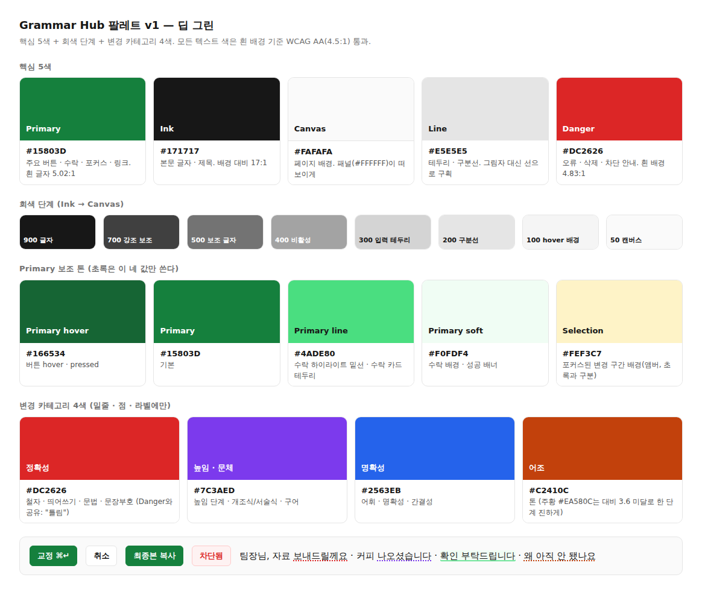

# 디자인 토큰 v1 — 팔레트 (2026-09-17)

> B안(Ant Design 전환) 전에 확정하는 색 체계. 스와치: `docs/assets/palette-v1.png`.
> 원칙: **초록은 "행동"에만, 회색이 구조를 만들고, 카테고리 4색은 밑줄·점·라벨에만.**



## 1. 핵심 5색

| 역할 | 값 | 쓰는 곳 | 대비(흰 배경) |
|---|---|---|---:|
| **Primary** | `#15803D` | 주요 버튼(교정·복사), 수락 ✓, 포커스 링, 링크 | 흰 글자 5.02:1 AA |
| **Ink** | `#171717` | 본문·제목 글자 | 캔버스 위 17.2:1 |
| **Canvas** | `#FAFAFA` | 페이지 배경. 패널은 `#FFFFFF` | |
| **Line** | `#E5E5E5` | 테두리·구분선. 그림자 대신 선으로 구획 | |
| **Danger** | `#DC2626` | 오류·삭제·차단 안내. 정확성 카테고리와 공유("틀림"의 의미가 같음) | 4.83:1 AA |

## 2. 회색 단계 (Tailwind neutral 그대로)

| 단계 | 값 | 용도 |
|---|---|---|
| 900 | `#171717` | 글자 |
| 700 | `#404040` | 강조 보조 글자, 세그먼트 선택 텍스트 |
| 500 | `#737373` | 보조 글자(캡션·메타). 흰 배경 4.74:1, 캔버스 4.54:1 AA |
| 400 | `#A3A3A3` | 비활성·플레이스홀더 |
| 300 | `#D4D4D4` | 입력 테두리, kbd |
| 200 | `#E5E5E5` | 구분선(=Line) |
| 100 | `#F5F5F5` | hover 배경, 세그먼트 트랙 |
| 50 | `#FAFAFA` | 캔버스 |

## 3. Primary 보조 톤 (초록은 이 값들만)

| 이름 | 값 | 용도 |
|---|---|---|
| primary-hover | `#166534` | 버튼 hover/pressed. 흰 글자 7.13:1 |
| primary | `#15803D` | 기본 |
| primary-line | `#4ADE80` | 수락 하이라이트 밑선, 수락 카드 테두리 |
| primary-soft | `#F0FDF4` | 수락 하이라이트 배경, 성공 배너 |
| selection | `#FEF3C7` (앰버) | 포커스된 변경 구간 배경. 초록(수락)과 구분하려고 의도적으로 다른 색 |

## 4. 변경 카테고리 4색 (밑줄 · 점 · 라벨 텍스트에만, 배경 채움 금지)

| 계열 | 값 | 포함 카테고리 | 대비 |
|---|---|---|---:|
| 정확성 | `#DC2626` | SPACING · SPELLING · GRAMMAR · PUNCTUATION | 4.83 AA |
| 높임·문체 | `#7C3AED` | HONORIFIC · REGISTER | 5.70 AA |
| 명확성 | `#2563EB` | WORD_CHOICE · CLARITY · CONCISENESS | 5.17 AA |
| 어조 | `#C2410C` | TONE | 5.18 AA (`#EA580C`는 3.56으로 미달) |

## 5. 상태색

| 상태 | 값 | 비고 |
|---|---|---|
| success | primary 공유 | 별도 초록을 만들지 않음 |
| danger | `#DC2626` / soft `#FEF2F2` / line `#FECACA` | 에러 배너 |
| warning | `#B45309` / soft `#FFFBEB` | 5.02 AA. 거의 안 씀(미확정 제안 배지 정도) |
| info | 회색으로 처리 | 파랑을 쓰면 명확성 카테고리와 겹침 |

## 6. 다크모드 (B안에서)
**v2 (2026-09-22).** v1(Canvas `#0A0A0A` · Panel `#171717` · Line `#262626` · muted `#A3A3A3`)은 실사용에서 "너무 어두워 글이 안 보인다"는 피드백을 받았다. 화면을 찍어 보니 바탕·패널·선이 서로 구분되지 않고, 12px 보조 텍스트가 묻히고, Segmented의 선택 항목이 트랙과 같은 색이었다. 바꾼 값(`apps/web/lib/theme/tokens.ts` `DARK`):

| 토큰 | v1 | v2 | 이유 |
|---|---|---|---|
| Canvas / Panel / Elevated | `#0A0A0A` / `#171717` / — | `#161618` / `#1F1F23` / `#26262B` | 세 표면이 구분되게 두 단계 올림 |
| Line / Border | `#262626` / `#404040` | `#34343A` / `#55555E` | 카드·입력 테두리가 보이게 |
| Ink / muted / tertiary / placeholder | `#FAFAFA` / `#A3A3A3` / (라이트와 동일) | `#F4F4F5` / `#C6C6CD` / `#9A9AA3` / `#80808A` | 보조 텍스트 대비 7:1 이상, 3단계 분리 |
| primary / soft | `#22C55E` / `rgba(34,197,94,.12)` | `#34D399` / `rgba(52,211,153,.16)` | 어두운 바탕에서 채도 낮추고 밝게 |
| fill quaternary/tertiary/secondary | 알고리즘 기본(거의 안 보임) | 백색 6% / 10% / 14% | pre·code·kbd 배경이 패널과 구분되게 |
| Segmented 선택/트랙 | Panel / Line | `#3A3A42` / `#2A2A30` | 선택 항목이 보이게 |
| Input·Select 배경 | Panel과 동일 | `#18181B` | 패널 안 입력칸이 구분되게 |
| Alert 배경·테두리 | 알고리즘 기본 | info·warning·error·success 각각 저채도 12~16% + 테두리 | 정보 상자가 뜨지 않고 읽히게 |

카테고리 4색은 v1 그대로(`#F87171` `#A78BFA` `#60A5FA` `#FB923C`). 확인 방법: `apps/web/e2e/`에서 playwright로 `colorScheme: "dark"` 스크린샷을 찍어 보는 것이 가장 빠르다.

## 7. 코드 매핑

### Tailwind v4 (`apps/web/app/globals.css` `@theme`)
```css
--color-primary: #15803D;  --color-primary-hover: #166534;
--color-primary-line: #4ADE80;  --color-primary-soft: #F0FDF4;
--color-selection: #FEF3C7;  --color-danger: #DC2626;
--color-cat-accuracy: #DC2626; --color-cat-register: #7C3AED;
--color-cat-clarity: #2563EB;  --color-cat-tone: #C2410C;
```

### Ant Design v6 `ConfigProvider` (B안)
```ts
theme={{
  cssVar: true,
  algorithm: [theme.compactAlgorithm],            // 다크: [theme.darkAlgorithm, theme.compactAlgorithm]
  token: {
    colorPrimary: "#15803D", colorSuccess: "#15803D", colorError: "#DC2626", colorWarning: "#B45309",
    colorInfo: "#737373",                          // 파랑 대신 회색
    colorText: "#171717", colorTextSecondary: "#737373", colorTextTertiary: "#A3A3A3",
    colorBorder: "#D4D4D4", colorBorderSecondary: "#E5E5E5",
    colorBgLayout: "#FAFAFA", colorBgContainer: "#FFFFFF",
    borderRadius: 6, fontFamily: "'Pretendard Variable', Pretendard, -apple-system, system-ui, sans-serif",
    fontSize: 14, lineHeight: 1.6,
  },
  components: { Button: { primaryShadow: "none" }, Card: { boxShadowTertiary: "0 1px 2px rgba(0,0,0,.04)" } },
}}
```
AntD 기본 그린(`green-6 #52C41A`, `green-7 #389E0D`)은 흰 글자 대비가 2.3 / 3.5로 미달이라 쓰지 않는다.

## 8. 사용 규칙 (요약)
1. 초록은 주요 버튼·수락·수락 배경 세 곳. 아이콘 장식이나 제목에 쓰지 않는다.
2. 카테고리 색은 밑줄·점·라벨 글자. 배경으로 채우지 않는다(10색 파스텔 배경이 시끄러웠던 원인).
3. 정보·중립 강조는 회색 700. 파랑 사용 금지(명확성과 겹침).
4. 포커스는 앰버 배경 + primary 링. 수락(초록)과 항상 구분.
5. 그림자는 패널 한 겹만(`0 1px 2px rgba(0,0,0,.04)`). 카드는 선만.
