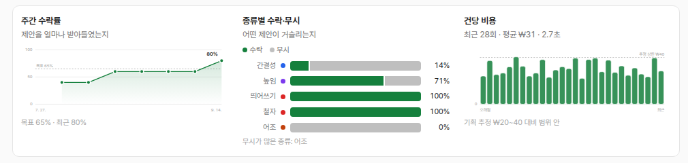
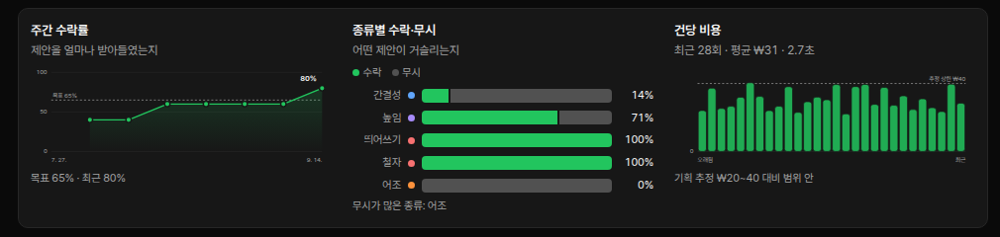
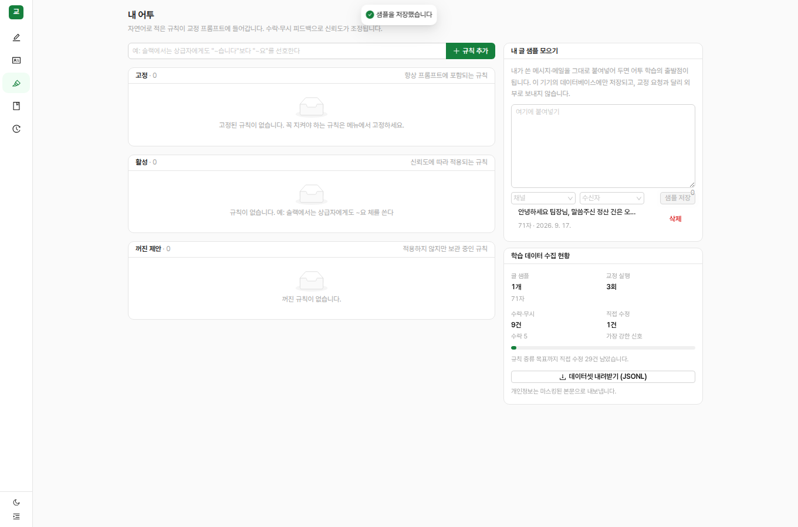

# 학습 데이터 수집과 기록 그래프 (2026-09-17)

> Phase 2(어투 학습)의 입력이 될 데이터를 지금부터 빠짐없이 모으고, 그 진행을 눈으로 확인할 수 있게 한다.

## 1. 기록 그래프 3종




의존성 없는 인라인 SVG로 그렸다. 차트 라이브러리를 추가하지 않은 이유는 선 1개와 막대 몇 개면 충분하고, 팔레트 CSS 변수를 그대로 써야 다크모드가 자동으로 따라오기 때문이다.

| 그래프 | 형태 | 보고 나서 하는 행동 |
|---|---|---|
| **주간 수락률** | 단일 시리즈 선 + 목표선(65%). 데이터가 1주뿐이면 선 대신 큰 숫자 | 정체면 프롬프트·규칙 손보기, 오르면 Phase 2 진행 |
| **종류별 수락·무시** | 가로 스택 막대(수락 초록 / 무시 회색), 마크 사이 2px 간격 | 무시율 높은 카테고리를 끄거나 지침 완화 |
| **건당 비용** | 세로 막대 + 추정 상한(₩40) 기준선 | 초과면 캐시·모델·강도 점검 |

시각화 규칙(dataviz): 단일 시리즈는 범례 없이 제목이 시리즈를 지칭, 값 라벨은 마지막 점에만, 텍스트는 잉크 색(시리즈 색 금지), 축·격자는 후퇴, 모든 마크에 hover 툴팁. 카테고리 색은 팔레트 v1의 4계열을 그대로 쓴다.

## 2. 수집하는 데이터



| 신호 | 언제 생기나 | 쓰임 |
|---|---|---|
| **글 샘플** | 내 어투 화면에서 직접 붙여넣기(채널·수신자 태그) | 초기 규칙 초안의 few-shot 예시 |
| **수락 / 무시** | 변경 카드의 ✓ ✕ | 규칙 신뢰도(Beta 분포)의 α/β |
| **직접 수정** | 결과를 손으로 고친 뒤 복사 | **가장 강한 신호.** 제안 적용본과 최종본을 비교해 자동 기록 |
| **대안 선택** | 톤 대안 3안 중 선택 | pairwise 선호쌍 |
| **카테고리 끄기** | "이런 제안 끄기" | demoted 규칙(즉시 프롬프트에 반영) |
| **최종본** | 복사할 때마다 | 무수정 복사율 계산의 분모 |

직접 수정 감지는 서버가 한다. 복사 시점에 "수락한 제안만 적용한 결과"를 계산해 실제 최종본과 다르면 `edit` 피드백으로 남긴다. 사용자가 따로 버튼을 누를 필요가 없다.

## 3. 데이터셋 내보내기

`GET /api/dataset` → JSONL. 내 어투 화면의 "데이터셋 내려받기" 버튼과 같다.

```jsonl
{"type":"sample","at":"…","channel":"messenger","audience":"boss","text":"…"}
{"type":"run","runId":"…","level":"L2","draft":"…","masked":true,"finalText":"…",
 "decisions":[{"action":"accept","category":"SPELLING","original":"…","replacement":"…","reason":"…"}],
 "rewrites":[{"label":"더 정중","text":"…","chosen":true}]}
```

**개인정보는 마스킹본으로 내보낸다.** 원문 대신 `textMasked`를 쓰므로 전화번호·이메일이 파일에 남지 않는다(테스트로 확인).

## 4. 목표치

| 신호 | Phase 2 착수 기준 | 이유 |
|---|---|---|
| 직접 수정 | **30건** | 규칙 증류의 최소 입력. 화면의 진행 막대가 이 기준 |
| 글 샘플 | 300~500단어 이상 | Writer.com 권장치. 초기 프로필 부트스트랩 |
| 수락·무시 | 200건 이상 | 카테고리별 통계가 의미를 갖는 최소치 |

## 5. 다음 단계
실제 API 키로 2주 정도 쓰면 위 수치가 채워진다. 그 시점에 `node tools/report-week.mjs`와 기록 그래프를 함께 보고 Phase 2(규칙 증류 + 예시 검색)로 넘어간다.
